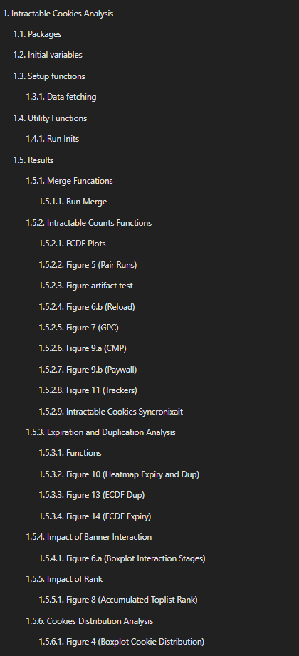
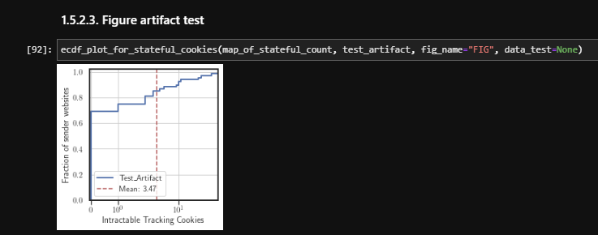

# Artifact Appendix

**Paper Title:**  
**Intractable Cookie Crumbs: Unveiling the Nexus of Stateful Banner Interaction and Tracking Cookies**

**Artifacts HotCRP ID:**  
**#30**

**Requested Badge:**  
**Available** and/or **Functional**

---

## Description

This document provides instructions for installing and running _BannerClick_ to conduct measurements on intractable cookies, as described in our paper. It also explains how to analyze the collected data and reproduce the results presented in the paper using the released datasets.

---

## Security/Privacy Issues and Ethical Concerns

There are no known major or minor security, privacy, or ethical concerns related to this artifact.

---

## Basic Requirements (For Functional and Reproduced Badges)

### Hardware Requirements

The measurements do not require any special hardware. As long as the machine can open a browser and crawl websites one by one, it meets the minimum requirement for conducting a sample measurement.

### Software Requirements

All measurements were conducted using a Debian-based Linux distribution with Kernel: Linux 4.19.0-20-cloud-amd64.
Software dependencies are listed in the `environment.yaml` file. These will be installed during the installation using Conda (we used Conda version 23.1.0).
Note that OpenWPM is officially supported only for Linux platfrom.

### Estimated Time and Storage Requirements

Storage needs depend on the number of domains. For example:

- A crawl of 20,000 domains consumes under 10 GB.
- The full dataset used in our analysis is approximately 70 GB.

Time requirements also vary:

- A complete 20k-domain crawl takes ~2 weeks (10 days for the first stage, 5 days for the second).
- A sample run on 400 domains takes around 3 hours.

---

## Environment Setup

### Accessibility

The artifact consists of:

1. **BannerClick source code (taged for the artifact evaluation)** at a public github repository: [https://github.com/bannerclick/bannerclick/tree/v0.26.0_pets25_artifact](https://github.com/bannerclick/bannerclick/tree/v0.26.0_pets25_artifact)
2. **Analysis scripts and dataset** at Edmond as a research data repository for Max Planck researchers: [https://edmond.mpg.de/dataset.xhtml?persistentId=doi:10.17617/3.QZCILK](https://edmond.mpg.de/dataset.xhtml?persistentId=doi:10.17617/3.QZCILK)
3. **Project homepage** with further links and resources: [https://bannerclick.github.io/](https://bannerclick.github.io/)

### Installation

To install BannerClick, first clone the repository and ensure Conda is installed. The artifact version is tagged as `v0.26.0_pets25_artifact`.

```bash
git checkout tags/v0.26.0_pets25_artifact
./install.sh
conda activate openwpm
```

Note: On some systems, it may be necessary to install the following packages to enable crawling:

```bash
sudo apt-get install -y libx11-xcb1 libdbus-glib-1-2 libxt6 libasound2 libgtk-3-0 libgdk-pixbuf2.0-0 libdrm2
```

### Testing the Environment

You can verify that everything is working by running:

```bash
python demo.py --bannerclick --headless --num-browsers 1 --num-repetitions 5
```

Current configuration settings (in the [`bannerclick/config.py file`](https://github.com/bannerclick/bannerclick/blob/v0.26.0_pets25_artifact/bannerclick/config.py)) are:

- `urls_file = "top-1m-old.csv"`
- `STEP_SIZE = 400`
- `SWITCH_INDEX = 200`
- `GPC_signal = False`

This means the run processes the first 400 domains from the Tranco list, accepts banners on the first 200, and rejects banners on the rest. The results are stored in a directory named after the `run_name` variable, with a SQLite database (`crawl-data.sqlite`).

---

## Main Results and Claims

After running a successful measurement, the data should be moved to the analysis folder for further analysis:

```bash
mv bannerclick/datadir/<run_name> reproducibility/data/
```

The `reproducibility.txz` file is available at the Edmond repository mentioned above. To run the analysis:

1. Extract the archive:

```bash
tar Jxvf reproducibility.txz
```

2. Install the Python packages listed in `requirement.txt`.
3. Launch JupyterLab:

```bash
jupyter-lab
```

4. Open and run the notebook located at `reproducibility/analysis.ipynb`.

### Results

The main contribution is the measurement of intractable cookies under different scenarios. The figures are generated within `analysis.ipynb` and are labeled consistently with the sections in the paper where they are discussed. The figure below is a screenshot of the table of contents in JupyterLab. The first four subsections before section 1.5 ("Results") include functions and preprocessing snippets that perform initial tasks such as fetching data from the databases, storing them in dataframes, and running the initial preprocessing needed for further analysis in the results section. As shown, in the results section, each figure is labeled with the same number as it appears in the paper.



After running the prerequisite functions, you can plot the figures for the captured data using the provided ready-to-use methods. For instance, to plot the ECDF for the sample run:

```python
ecdf_plot_for_stateful_cookies(map_of_stateful_count, test_artifact, fig_name="FIG", data_test=None)
```

Which results in the following figure:



Note: The sample run results in a lower average (e.g., 3.47 intractable cookies) due to the limited scope (only 200 domains for stage 1).

---

## Experiments

The default configuration runs a simplified experiment using the top 400 Tranco domains:

```bash
python demo.py --bannerclick --headless --num-browsers 1 --num-repetitions 5
```

Data is stored in:

```
bannerclick/datadir/<run_name>/1--SP0/crawl-data.sqlite
```

---

## Limitations

While all figures and tables in the paper are fully reproducible using the released data, re-generating the dataset from scratch is not practical due to:

- High runtime (each complete run takes ~2 weeks).
- Dynamic nature of the web, making exact reproduction infeasible.

---
