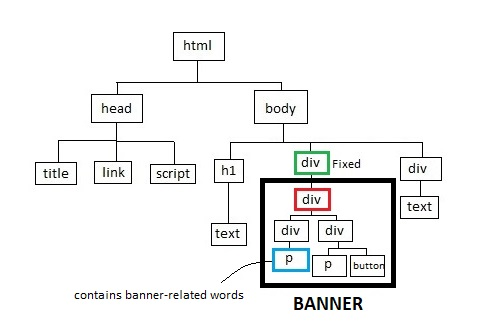

## Dependencies:
selenium\
pyautogui\
pandas\
numpy\
beautifulsoup4

## Banner Detection package

**bannerdetection.py**\
This file is the main file of the package and contains all the main functionalities like detecting banner, translating the page, taking screenshots and so forth (TODOS).  
Using *init()* methods, one can instantiate the primary variables like files, driver; and by running *run_all()* method, it is possible to execute all the main methods for a set of domains which can be passed as the argument to the bannerdetection.py file by *-f/--file FILENAME* or manually by setting the *file* argument in *init(file=FILENAME)* function.  
By running the code below these would happen:  

```python
import bannerdetection as bd
bd.init("urlfile.txt")
bd.run_all()
```    

1. At first, it extracts URLs in *'urlfile.txt'* and instantiates the webdriver.
2. Running *run_all()*, the program starts to detect the banner for each URL in the file. If any detected, it takes a screenshot of it and adds its characteristics to DataBase.csv.

**utilityMethods.py**\
For the sake of readability, all the main logical part of the program are included in this file, e.g. opening the domain page, finding cookie banners, finding iframe CMP, etc.

**elementMethods.py**\
This file consists of all element-based methods, e.g. finding a common ancestor among several elements, checking if the element is inside a fixed element, finding the path between two elements, etc.

**textMethods.py**\
Methods for manipulating and modifying strings are included in this file, e.g. removing all classes from a given HTML-formatted string, building the XPath format string for a certain And-Or logic.


## How it works

* *detect_banner():*
    This method tries to detect the possible banners inside the running webpage; there are four main components that the code tries to find, in its way of finding the banner:
    1. Path: Set of nodes that encompasses the root nodes that are related to the banner.
    2. Last node of the path: Elements with the Cookies-related words.
    3. First node of the path: If there is a node with a fixed position/positive z-index attribute along the way from last node till body node, that element is set to the starting point of the path, otherwise the body tag itself is the starting point.
    4. Optimal node: The bottommost descent element which contains all the cookie banner related elements.
    
    These components in the image below is like this:
    * Path: <span style="color:green">div</span>(green)-<span style="color:red">div</span>(red)-<span style="color:black">div</span>-<span style="color:blue">p</span>(blue)
    * Last node: <span style="color:blue">p</span>(blue)
    * First node: <span style="color:green">div</span>(green)
    * Optimal node: <span style="color:red">div</span>(red)
    
    
    
    The workflow to finding these components is as follows: 
    
    1. Finding the last node:
        * `find_els_with_cookie(body_el)` scrapes all the elements that have the cookies-related words.
            * `pruning_els(els)` tries to rule out unrelated elements like those are in `<footer>, <header>, <script>` tags or those are invisible.
    2. Finding the first node:
        * (for fixed position approach) `find_fixed_ancestors(els_with_cookie)` tries to find fixed ancestors of those last nodes. If failed it would set to *body* tag itself.
        * (for z-index approach) `find_by_zindex(els_with_cookie)` tries to find ancestors which have positive z-index attribute. If failed it would set to *body* tag itself.
            * The (first node, last node) pair of each path is stored in the dictionary by the first node as the key; thus, last nodes with the same first node is supposed to be in one common banner. (`banners_map[first_node] = last_node`)
    3. Finding optimal node: After finding the paths, `find_optimal(driver, path)` traverses the path from starting node to the last one and tries to find the best possible element in between as the primary representative of the banner. It exploits several heuristics to do so:
        * `is_size_equal_to_win(driver, head_el)` checks whether the size of the candidate node is equal to window size or not. If yes, then it cannot be a valid banner and should traverses deeper to find more shrunk yet inclusive tag element.
        * `is_there_major_child(driver, head_el, path)` checks whether there is a child in the path that is smaller in size and still encompassed complete text and all the elements (whose opacity level are more than 0.8) that the current element contains. If there were such element that would be the next candidate for optimal node.
            * There are some child elements with zero sizes which can cause false positive. To eliminate such cases `is_one_dimension(head_el)` uses for detecting zero-sized elements.
        
    1-3 is repeated for all the iframe elements to check whether there is a cookies-related frame.  
    
    If no banner is found and the language of the webpage is something rather than English, then, it translates the page and repeats all the process above for the translated page.
    
After detecting banners, some methods can be used for data collecting purposes:
    
* *take_current_page_sc():* This element takes the screenshot of the current running webpage.
* *take_banners_sc(banners):* This method takes the screenshot of banners passed as a list.
* *extract_banners_data(banners):* This method saves the characteristics of banners passed as a list in the database.

